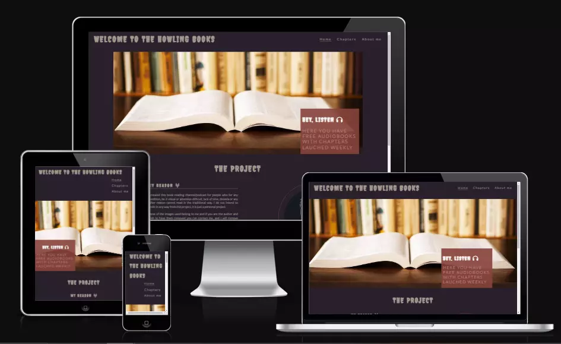

# MILESTONE 1 - HOWLING BOOKS - TESTING DOCUMENTATION

"Howling Books" is a podcast of a fictional (werewolf) character who tells stories to werewolves pups around a fire at night in a forest as it is the role of a Galliard of the werewolves.

This website intends to inform the audience about new releases and news about the podcast as the reason why it might get an episode delayed or any announcement that needs to be made to the audience.

[Source](https://ui.dev/amiresponsive?url=https://tkml87.github.io/project-portfolio-1/)

Visit the deployed site: [Howling Books](https://tkml87.github.io/project-portfolio-1)

---

## CONTENTS

- [MILESTONE 1 - HOWLING BOOKS - TESTING DOCUMENTATION](#milestone-1---howling-books---testing-documentation)
  - [CONTENTS](#contents)
  - [AUTOMATED TESTING](#automated-testing)
    - [W3C Validator](#w3c-validator)
    - [Lighthouse](#lighthouse)
    - [WAVE](#wave)
  - [MANUAL TESTING](#manual-testing)
    - [Testing User Stories](#testing-user-stories)
    - [Full Testing](#full-testing)
  - [BUGS](#bugs)
    - [Known Bugs](#known-bugs)
    - [Solved Bugs](#solved-bugs)

All during the build, testing was ongoing. While developing, I used the developer tools in Chrome to identify and fix any problems as they arose.

To make sure that each page is fully responsive on a range of different screen sizes and devices, each page has been examined using the Google Chrome Developer Tools, Brave Browser and Tor. On a variety of actual devices, the site's responsiveness was also evaluated.

---

## AUTOMATED TESTING

The Automated Testing includes all the testing that is carried out by a program, like W3C HTML validation.

### W3C Validator

W3C was used to validate the HTML on all pages of the website. It was also used to validate the CSS.

[index.html](https://validator.w3.org/nu/?showoutline=yes&doc=https%3A%2F%2Ftkml87.github.io%2Fproject-portfolio-1%2Findex.html) - Passed.

[chap.html](https://validator.w3.org/nu/?showoutline=yes&doc=https%3A%2F%2Ftkml87.github.io%2Fproject-portfolio-1%2Fchap.html) - Passed.

[about.html](https://validator.w3.org/nu/?showoutline=yes&doc=https%3A%2F%2Ftkml87.github.io%2Fproject-portfolio-1%2Fabout.html) - Passed.

[form.html](https://validator.w3.org/nu/?doc=https%3A%2F%2Ftkml87.github.io%2Fproject-portfolio-1%2Fform.html) - Passed.

[404.html](https://validator.w3.org/nu/?showoutline=yes&doc=https%3A%2F%2Ftkml87.github.io%2Fproject-portfolio-1%2F404.html) - Passed.

500.html - Passed.

[style.css](https://www.dropbox.com/s/j04u2josif4wy5u/css.PNG?dl=0) - Passed, no errors found.

### Lighthouse

I used Lighthouse within the Chrome Developer Tools to test the performance, accessibility, best practices and SEO of the website.

_Desktop Results_
All pages of the site are achieving a score of 100 across the 4 categories.

### WAVE

👩🏻‍💻 View an example of a completed WAVE testing section [here](https://github.com/kera-cudmore/earth-day-hackathon-2022/blob/main/TESTING.md#WAVE)

[WAVE](https://wave.webaim.org/) is an accessibility testing tool. I like to run this on each page of my site and take a screenshot of the results to add here. They have a website for testing and a Chrome extension.

## MANUAL TESTING

### Testing User Stories

👩🏻‍💻 View an example of a completed user stories testing section [here](https://github.com/kera-cudmore/BookWorm/blob/main/TESTING.md#Testing-User-Stories)

This is where you will test the user stories you created in the README against your site. I like to use a table for this section - I create a column for the user stories goals, how these have been achieved and I use the third column to add any supporting images.

### Full Testing

👩🏻‍💻 View an example of a completed full testing section [here](https://github.com/kera-cudmore/TheQuizArms/blob/main/TESTING.md#Full-Testing)

Full testing can be tedious, so it is great to try and break this part up into smaller chunks and do a bit at a time. Full testing is when you go through the site and test every single thing that can be tested. So for example you would test that all links in the navbar correctly redirect the user to where there are supposed to go. A table is the perfect way to display this information.

## BUGS

### Known Bugs

List (or put in a table) all known bugs on your site here as soon as you find them. This will prevent you from forgetting any at the end. Some (if not all) of these bugs will hopefully make their way over to the next section, solved bugs, as you progress through your project.

### Solved Bugs

👩🏻‍💻View an example of a completed bugs section [here](https://github.com/kera-cudmore/BookWorm/blob/main/TESTING.md#BUGS)

This is where all solved bugs go once squashed. List what the bug was, and how you managed to fix it. You can also include images/videos here if you wanted.